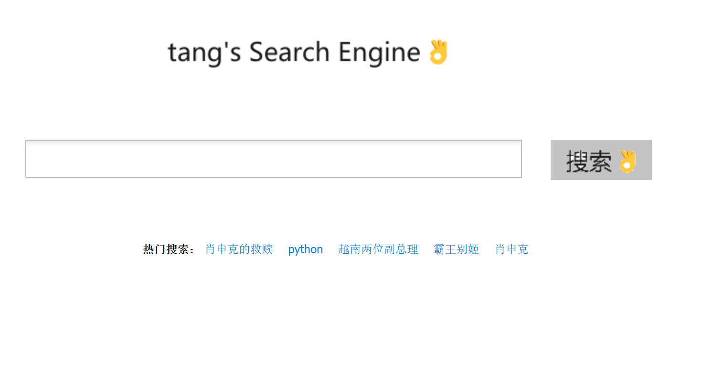
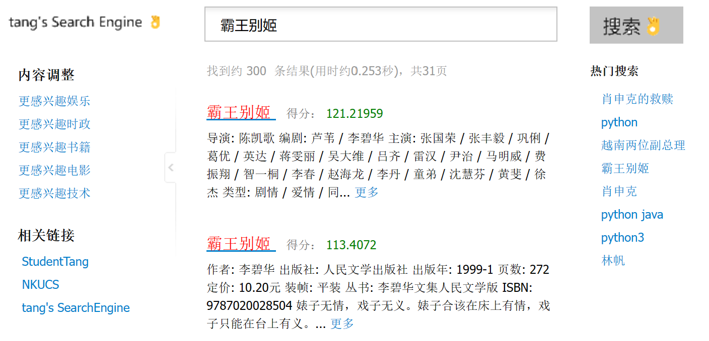
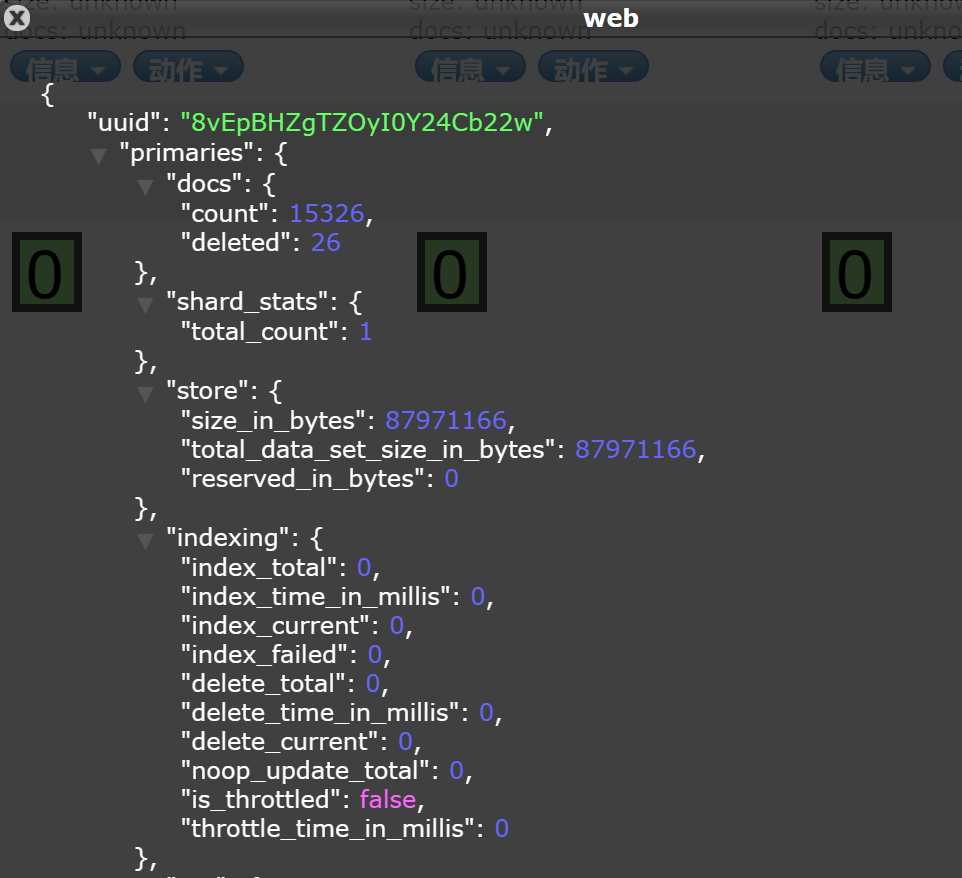
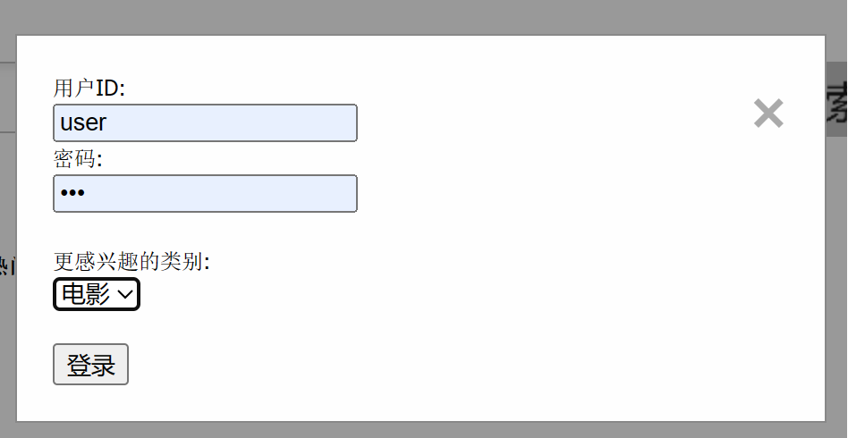
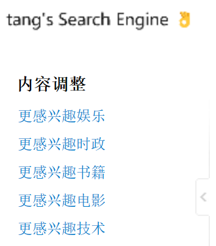

# HW5 Web搜索引擎

## 项目结构

```
SEARCHENGINE
├─crawler: 网页爬取
├─index: 建立倒排索引
├─pageRank: 链接分析
├─pic: README使用的图片
└─web: Flask后端服务器
    ├─logs: 查询日志
    ├─query: 查询功能实现
    ├─recommend: 推荐系统
    ├─static: Web前端
    │  ├─css
    │  ├─img
    │  └─js
    └─templates: 前端模板
```

## Web页面
使用`Flask`框架搭建Web页面，前端网页使用下载的网页模板，实现了与后端搜索引擎逻辑正常交互  

Web功能包括：
- 用户登录
- 基本搜索与若干高级搜索
- 侧边显示热门搜索记录
- 底部显示相关搜索（推荐系统）
- 搜索结果关键词高亮
- 侧边交互按钮与相关链接

主页和搜索结果页面如下（完整功能见演示视频）：
<center>
<table>
  <tr>
    <td></td>
    <td></td>
  </tr>
</table>
</center>

## 网页抓取
网页抓取部分，使用以下库实现了爬虫功能：
- 使用`beautifulsoup4`库进行网页抓取
- 使用`requests`库进行网页请求
- 使用`urllib`库进行url解析

爬取主要使用两种方法：  

第一方法是精细化爬虫，**分析网页结构后进行爬取**  
从一个目录网页进行往下爬取，爬取的内容干净整洁，没有过多的冗余  
内容包括新闻网页，电影书籍介绍及其相关影评书评  

第二方法是爬虫pipline，从一个种子网页开始，爬取网页，提取网页内的url放入url池，**广度优先爬取**  
爬取出的网页内容存在一定冗余，所以后续进行了数据清洗，解决了如网页乱码，网页重复等问题  

总计爬取网页数目为：**15000+**，完整代码见`crawler`文件夹

## 文本索引
使用**ElasticSearch**建立索引，索引的数据来源于爬虫保存的MySQL数据库，索引的结构与MySQL数据库的表结构基本一致  

<center>

</center>

建索引的整体逻辑如下：
1. 使用`pymysql`库从MySQL数据库中读取数据
2. 使用`Elasticsearch.indices.create()`建立索引
3. 使用`Elasticsearch.create()`插入数据

建立es索引与映射的代码如下，完整代码见`index`文件夹：
```python
body = {
    "settings": {
        "analysis": {
            "analyzer": {
                "default": {
                    "type": "ik_max_word"
                }
            }
        }
    },
    "mappings": {
        "properties": {
            "web_id": {
                "type": "integer"
            },
            "title": {
                "type": "text",
                "analyzer": "ik_max_word"
            },
            "content": {
                "type": "text",
                "analyzer": "ik_max_word"
            },
            "url": {
                "type": "keyword"
            },
            "type": {
                "type": "keyword"
            }
        }
    }
}
```

## 链接分析
在爬虫部分保存了保存了网页之间的链接关系，使用`PageRank`算法对网页进行链接分析，获取了相应的网页权重，作为字段放入es索引中  

代码逻辑如下：
1. 使用`networkx`构建有向图，使用`pymysql`读取MySQL数据库中的数据，将网页的url作为节点，网页的出链作为边，构建有向图
2. 使用`networkx.pagerank()`计算之前构建的有向图的pageRank值
3. 使用`Elasticsearch.update()`更新es索引中的数据，添加pageRank字段
4. 查询时通过es的`script_score`来改变文档得分
5. 由于整体网页量太少，各文档的pageRank值相差过大，所以**使用函数进行了平滑**

es检索时，`script_score`的使用以及函数平滑的代码如下，完整代码见`pageRank`文件夹：
```python
"script_score": {
    "script": {
        "source": "doc['pageRank'].value == 0 ? 1 : Math.log1p(doc['pageRank'].value * params.factor)",
        "params": {
            "factor": 100000
        }
    }
},
"boost_mode": "sum"
```

## 查询服务
除了基本的查询外，提供以下高级查询功能，并提供查询日志，下面介绍各个功能的**核心实现逻辑**：

#### 1. bool查询  -- 包含，包含任意一个，不包含     
使用es的must，should，must_not进行过滤查询实现：

```python
"query": {
    "bool": {
        "must": must_queries,
        "must_not": mustnot_queries,
        "should": should_queries
    }
},
```

#### 2. 位置查询  -- 指定关键字的位置，如标题，正文，url
在构造查询语句时，指定查询的字段，如标题，正文，url，代码如下：

```python
for m in must:
    must_queries.append({"multi_match": {"query": m, "fields": position}})
for mn in mustnot:
    mustnot_queries.append({"multi_match": {"query": mn, "fields": position}})
for s in should:
    should_queries.append({"multi_match": {"query": s, "fields": position}})
```

#### 3. 短语查询  -- 精准匹配查询短语
在使用es查询时，指定查询的类型为phrase：

```python
"type": "phrase"
```

#### 4. 统配符&正则表达式查询  -- 查询中包含通配符/正则表达式
使用es的wildcard和regexp查询实现，代码示例如下：

```python
"regexp": {
    "title": {
        "value": query,
        "flags": "ALL",
        "case_insensitive": True,
        "max_determinized_states": 10000,
        "rewrite": "constant_score"
    }
}
```

#### 5. 模糊查询  -- 查询中包含拼写错误
在使用es查询时，添加fuzziness参数：

```python
"fuzziness": "AUTO"
```

#### 6. 站内查询  -- 指定站点，查询结果只包含指定站点的网页
对查询结果的url进行过滤，只保留指定站点的网页：

```python
results = [result for result in results if url in result['url']]
```

#### 7. 查询日志
除了在MySQL数据库中保存了用户查询记录外，还将用户查询保存在query.log文件中，保存格式示例如下：

```
[2023-12-26 22:18:32]	<basic_search>	肖申克
[2023-12-27 13:59:30]	<phase_search>	肖申克的救赎
[2023-12-27 16:52:15]	<site_search>	[url]:douban.com	[query]:肖申克
[2023-12-27 16:52:15]	<basic_search>	肖申克
[2023-12-27 16:52:45]	<regexp_search>	肖(.*)
```


## 个性化查询
在系统中加入了账号登录系统，从两个方面实现为不同的用户提供不同的内容排序

#### 感兴趣类别
在用户登录以及搜索结果页面，都设置了接口让用户调整自己更感兴趣的内容  
<center>
<table>
  <tr>
    <td></td>
    <td></td>
  </tr>
</table>
</center>

es进行检索时，使用**用户感兴趣的类别进行过滤**，如果文档属于用户感兴趣的类别，则通过`script_score`提高该文档最终的查询得分  
```python
"filter": {
    "term": {
        "type": self.label
    }
},
"script_score": {
    "script": {
        "source": "_score * 0.1"
    }
}
```

#### 网页点击记录
在查询结果页面，设置了`JavaScript`脚本，当用户点击某个网页时，将该网页的url传递到后端，后端将该url保存在用户的点击记录中  
```JavaScript
<script>
    window.onload = function() {
        var links = document.querySelectorAll('.title');
        links.forEach(function(link) {
            link.addEventListener('click', function(event) {
                event.preventDefault(); // 阻止默认的链接点击行为
                window.open(this.href);
                // 使用 AJAX 将 URL 传递到后端
                $.ajax({
                    url: '/results/handle_click', // Flask 路由
                    method: 'POST',
                    data: {
                        'url': this.href
                    },
                    success: function(response) {
                        console.log(response);
                    }
                });
            });
        });
    };
</script>
```

es进行检索时，使用**用户点击的网页进行过滤**，如果文档属于用户点击过的网页，则通过`script_score`提高该文档最终的查询得分
```python
"filter": {
    "terms": {
        "url": self.clicked_urls
    }
}
```

## 个性化推荐
推荐主要从两个方面进行：
1. 保存用户查询记录，选出**top query**与当前查询计算`cosine_similarity`，选择相似度高的热门搜索
2. 对原始网页进行kmeans聚类，保存网页所属类别以及过程中使用的模型；使用**保存的kmeans等模型预测**查询属于的类别，从**同一簇**里选取相似度高的网页

#### kmeans聚类
`recommend/clustering.ipynb`中使用kmeans对网页进行了聚类，把网页所属的类别保存到MySQL数据库中  

聚类的过程如下：
- 使用`mymysql`读取MySQL数据库中的数据
- 使用`jieba`对文本分词，去除停用词
- 使用`TfidfVectorizer`提取特征，得到数值向量
- 使用`PCA`对数组向量进行主成分分析降维
- 使用`KMeans`聚类，获取各个文档类别

将原始网页共计聚为24个类，除个别类数量异常（该部分在后续推荐时会介绍处理方法），其余类数量较为平均且数量适中，详见`clustering.ipynb`

#### 推荐系统
如前所述，推荐主要选取热门搜索记录和同一簇类高相似度的文本进行推荐，完整代码见`recommend/recommend.py`  

推荐系统执行流程如下：
- 使用聚类时**保存的模型**对查询进行转换和预测，得到查询所属的类别
- 从MySQL数据库中读取同一类别的网页
- 使用保存的模型将网页标题转为数值向量后，使用`cosine_similarity`计算相似度提取高相似网页
- 热门搜索同样，将搜索记录转为数值向量后，使用`cosine_similarity`计算相似度提取高相似记录
  
前面提到，聚类产生了个别异常类。对于属于这些类的查询，提高最终推荐结果中**热门搜索的占比**，簇中网页进行**随机采样计算相似度**，避免长时间计算拖慢搜索引擎速度