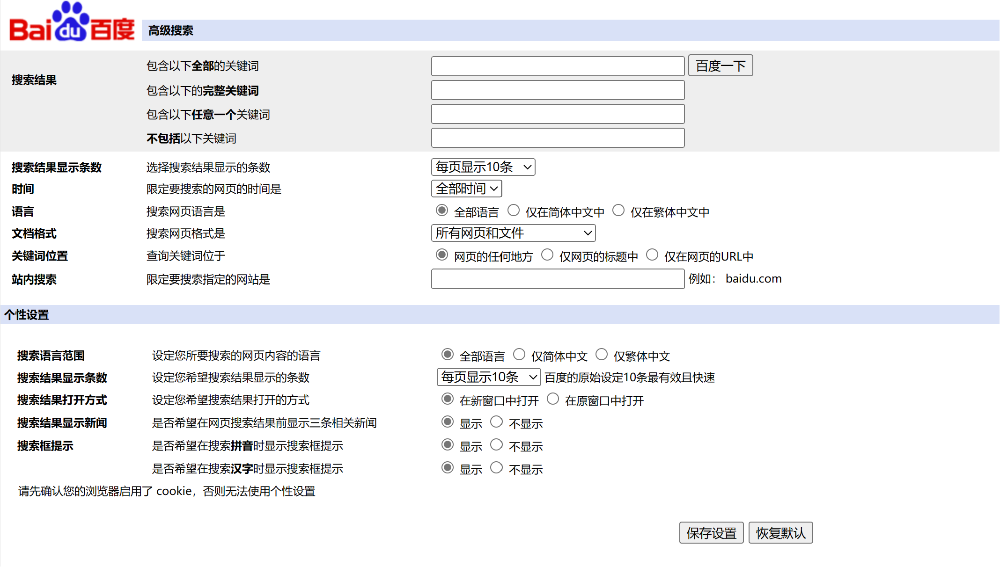

## query

提供查询服务  

1. 站内查询  -- 指定站点，指定站点的子站点
2. bool查询  -- 包含，包含任意一个，不包含
3. 短语查询
4. 统配符查询&正则表达式查询
5. 查询日志
6. 关键字位置

> Ranked？-> ES默认采用BM25算法  
> 使用function_score和script_score调整评分  
> 包括在title得分更高，pageRank高得分更高