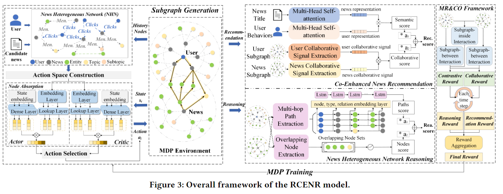

# RCENR
> [A Reinforced and Contrastive Heterogeneous Network Reasoning Model for Explainable News Recommendation](https://github.com/JiangHaoPG11/RCENR_code)

## 基本信息
- 发表刊物：  
  SIGIR 2023
- 作者：  
  Hao Jiang; Chuanzhen Li; Juanjuan Cai; Jingling Wang
- 第一完成单位：  
  Communication University of China
- 关键词：  
  新闻推荐；可解释推荐；知识推理；对比学习；马尔可夫决策过程
- keywords：  
  News Recommendation; Explainable Recommendation; Knowledge Reasoning; Contrastive Learning; Markov Decision Process

## 论文内容
- 解决的问题： TODO

- 论文主要方法： TODO

- 存在的问题： TODO

## 实验内容
- 数据集： TODO

- 涉及的实际应用场景： TODO

- 采用的对比方法： TODO

- 实验任务： TODO

- 实验衡量指标： TODO

- 实验说明的方法优点： TODO

## 思考

## 原文记录
### ABSTRACT
知识推理可以缓解新闻推荐中的数据稀疏性，并提供明确的推荐解释  
但现有的暴力预处理不适合快速变化的新闻推荐，提出RCENR  
RCENR由两个框架组成，在MIND数据集上实验得出其可以提高推荐的准确性、多样性、可解释性

### INTRODUCTION
> two critical and pending problems persist: (1) sparse and weak interaction data and (2) poor interpretability.

#### sparse and weak interaction data
新闻推荐算法因为有大量新闻而又很难收集到用户反馈(Clicks)，比普通推荐算法更难  
87.7%的新闻没人关注，而用户大概会点击20.14%的新闻。有些文章之前的文章并未关注到，希望准确捕捉用户对特定新闻的兴趣以对其建模  
协同过滤由于交互数据有限，性能差；基于内容的方法无法捕捉用户偏好；点击行为捕捉不足也导致很难建模
#### poor interpretability
新闻推荐使用协同过滤框架，可解释性差  
新闻推荐方法常把其编码器视为黑盒，不给出好解释用户不会满意  
知识推理探索用户和项目在KG中的路径，可给出明确解释，在推荐上也有提升，可以消除不相关行为的负面影响  

目前的知识推理将推理视为Markov Decision Process，并利用强化学习进行优化，但还是有所限制：
1. Slow Convergence Speed  
   奖励信号稀疏，因此推理网络收敛慢
2. Complex Pre-processing Steps  
   为了生成监督训练的ground-truth，需要预处理元路径或所有可行路径

本文给出新的新闻推荐模型RCENR  

文章提出一个新闻异构网络推理推荐模型NHN-R2，用于解决新闻推荐中的数据稀疏性和可解释性问题  
> News Heterogeneous Network Reasoning Recommendation (NHN-R2)

首先构建NHN集成用户交互信息和各类新闻；接着设计增强子图模块为每个用户-新闻对创建特定子图，应用于推荐和推理  
对于推荐任务，从子图中的吸收节点提取交互信号(P1)；对于推荐任务，提取子图的重叠节点和multi-hop路径，计算credit scores作为可解释度量(P2)  

对比学习通过数据增强自动生成正/负样本，在CV/NLP领域取得成功；本文提出融合强化学习和对比学习来训练NHN-R2的框架  
> Multi-task Reinforced and Contrastive Optimizing (MR&CO)

将子图的设计视为MDP，并设计了新颖的对比奖励，该方法可以手动构建奖励信号(P3)和消除预处理过程(P4)来加速收敛

### METHODOLOGY
#### Preliminaries
NHN：一个由实体额关系组成的图，包含各种实体集和知识关系  
基于NHN，作者推荐k个新闻给用户u，对于每一个新闻，模型会给出用户到新闻间的M-Hop paths以解释推荐原因  
（M-hop就是路径长M步）  
#### RCENR Framework

模型由三部分组成，最核心的是左边的NHN，为每个用户-新闻对生成子图（MDP过程）。以u-n对为中心，吸收周围的连接节点，生成子图用于后续推理和推荐  
中间部分就是推理推荐部分，包含两个子模块：增强子图模块和推理推荐模块。从2-D角度进行子图推理，更难揭示用户行为与新闻间的潜在关系  
右侧是一个端到端的优化框架，增强子图生成和任务协作
