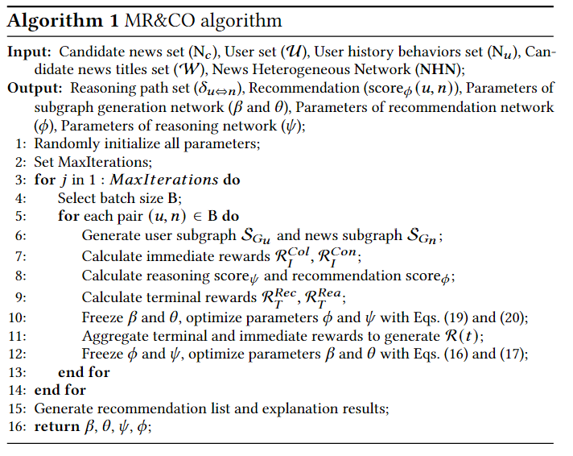
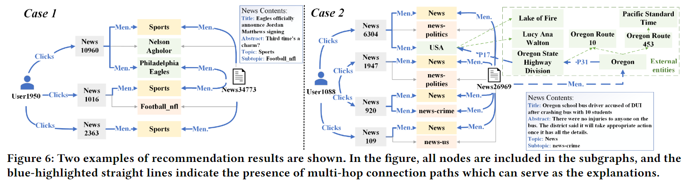

# RCENR
> [A Reinforced and Contrastive Heterogeneous Network Reasoning Model for Explainable News Recommendation](https://github.com/JiangHaoPG11/RCENR_code)

## 基本信息
- 发表刊物：  
  SIGIR 2023
- 作者：  
  Hao Jiang; Chuanzhen Li; Juanjuan Cai; Jingling Wang
- 第一完成单位：  
  Communication University of China
- 关键词：  
  新闻推荐；可解释推荐；知识推理；对比学习；马尔可夫决策过程
- keywords：  
  News Recommendation; Explainable Recommendation; Knowledge Reasoning; Contrastive Learning; Markov Decision Process

## 论文内容
- 解决的问题：  
  - 新闻推荐中的数据稀疏性和推荐结果的可解释性问题  
  - 另外还有使用强化学习进行知识推理的收敛速度慢、预处理复杂的问题

- 论文主要方法：  
  - NHN-R2：新闻异构网络推理推荐模型，使用生成子图来探索协作信号、吸收相关节点，揭示用户和新闻内容间的联系，进而进行推理和推荐  
  - MR&CO：联合多任务强化对比优化框架，基于强化学习，手动构建了四种奖励信号，进行自监督训练，优化子图生成、推理和推荐网络  
  - 将强化学习与对比学习结合，特别是奖励信号的构造，加速收敛，消除了预处理过程

- 存在的问题：  
  - 文中并未提及RCENR方法的不足
  - 本人认为方法上的问题是对图的利用不够充分，只是挖掘了相邻节点和多跳路径，也许还可以挖掘更多的结构信息
  - 另外MR&CO框架比较依赖于手动构造的奖励信号，泛化能力有限

## 实验内容
- 数据集：  
  - 实验采用的数据集是MIND（Microsoft News Dataset），包括MIND-sample和MIND-small两个版本。MIND-sample是来自对MIND-large的随机采样  
  - MIND数据集包含了来自MSN新闻网站上一个月的用户日志的100万条新闻内容和新闻点击信息，和模型需要解决的新闻推荐问题相对应

- 涉及的实际应用场景：  
  并未涉及真实应用场景，只是给出两个特定新闻推荐例子，验证模型的推荐和解释能力

- 采用的对比方法：  
  1. 性能测试时选取了三组baseline models: 基于编码器的推荐模型EB、基于图的推荐模型GB、基于知识的推荐模型KB，从每组中选择性能最佳的模型  
  2. 消融实验时逐个尝试移除MR&CO框架中的四种奖励信号，观察模型性能的变化  
  3. 时间消耗对比除了比较训练推理总时间，还比较了算法的复杂度  

- 实验任务：  
  1. 比较RCENR和其他方法的推荐和推理性能
  2. 验证MR&CO框架对模型性能的影响
  3. 比较生成的子图对下游任务（推理和推荐）的影响
  4. 评估模型是否为特定新闻给出了合理推荐和解释

- 实验衡量指标：  
  AUC(ROC曲线下的面积), MRR(平均倒数排名), NDCG@5(归一化折损累计增益), NDCG@10, AVP(连接路径的平均数量)

- 实验说明的方法优点：  
  1. RCENR有更高的推荐性能和更好的可解释性
  2. 生成子图拓展了搜索空间，结合MR&CO框架，提高了模型性能
  3. MR&CO让模型在不牺牲性能的情况下，模型消耗时间更短，复杂度更低
  4. 子图超参数平衡了推荐中的协作信号和语义信号，推理中的路径和重叠节点，提高了推荐性能和可解释性
  5. 模型能够消除噪声，并且还能充分利用外部知识给出合理推荐和解释

## 思考
### 论文的优点
1. 结合了强化学习和对比学习，专门为新闻推荐设计了四种奖励信号，使得算法收敛速度更快，提高了模型性能
2. 使用生成子图来挖掘数据中的协作信号、吸收相关节点，从稀疏数据中揭示了用户和新闻之间的潜在联系

### 论文改进空间
这里只讨论论文整体上的一些问题，方法上的问题见前
  - 还可以对更大的数据集(MIND-large)进行实验，验证模型的可扩展性
  - 文章并未给出方法复杂度的计算以及效率的详细分析

### 畅想
如果围绕此篇论文进行研究  
硬件上可能需要计算资源的支持，本文并未对MIND-large进行实验，有可能也是考虑到了硬件的限制  
技术上可能还需要更多图相关理论的支撑来提高NHN-R2的性能  
另外还可以考虑将MR&CO框架改进提高泛化性，将此方法应用到其他领域，比如电商推荐等

## 原文记录
### ABSTRACT
知识推理可以缓解新闻推荐中的数据稀疏性，并提供明确的推荐解释  
但现有的暴力预处理不适合快速变化的新闻推荐，提出RCENR  
RCENR由两个框架组成，在MIND数据集上实验得出其可以提高推荐的准确性、多样性、可解释性

### INTRODUCTION
> two critical and pending problems persist: (1) sparse and weak interaction data and (2) poor interpretability.

#### sparse and weak interaction data
新闻推荐算法因为有大量新闻而又很难收集到用户反馈(Clicks)，比普通推荐算法更难  
87.7%的新闻没人关注，而用户大概会点击20.14%的新闻。有些文章之前的文章并未关注到，希望准确捕捉用户对特定新闻的兴趣以对其建模  
协同过滤由于交互数据有限，性能差；基于内容的方法无法捕捉用户偏好；点击行为捕捉不足也导致很难建模
#### poor interpretability
新闻推荐使用协同过滤框架，可解释性差  
新闻推荐方法常把其编码器视为黑盒，不给出好解释用户不会满意  
知识推理探索用户和项目在KG中的路径，可给出明确解释，在推荐上也有提升，可以消除不相关行为的负面影响  

目前的知识推理将推理视为Markov Decision Process，并利用强化学习进行优化，但还是有所限制：
1. Slow Convergence Speed  
   奖励信号稀疏，因此推理网络收敛慢
2. Complex Pre-processing Steps  
   为了生成监督训练的ground-truth，需要预处理元路径或所有可行路径

本文给出新的新闻推荐模型RCENR  

文章提出一个新闻异构网络推理推荐模型NHN-R2，用于解决新闻推荐中的数据稀疏性和可解释性问题  
> News Heterogeneous Network Reasoning Recommendation (NHN-R2)

首先构建NHN集成用户交互信息和各类新闻；接着设计增强子图模块为每个用户-新闻对创建特定子图，应用于推荐和推理  
对于推荐任务，从子图中的吸收节点提取交互信号(P1)；对于推荐任务，提取子图的重叠节点和multi-hop路径，计算credit scores作为可解释度量(P2)  

对比学习通过数据增强自动生成正/负样本，在CV/NLP领域取得成功；本文提出融合强化学习和对比学习来训练NHN-R2的框架  
> Multi-task Reinforced and Contrastive Optimizing (MR&CO)

将子图的设计视为MDP，并设计了新颖的对比奖励，该方法可以手动构建奖励信号(P3)和消除预处理过程(P4)来加速收敛

### METHODOLOGY
#### Preliminaries
NHN：一个由实体额关系组成的图，包含各种实体集和知识关系  
基于NHN，作者推荐k个新闻给用户u，对于每一个新闻，模型会给出用户到新闻间的M-Hop paths以解释推荐原因  
（M-hop就是路径长M步）  
#### RCENR Framework

模型由三部分组成，最核心的是左边的NHN，为每个用户-新闻对生成子图（MDP过程）。以u-n对为中心，吸收周围的连接节点，生成子图用于后续推理和推荐  
中间部分就是推理推荐部分，包含两个子模块：增强子图模块和推理推荐模块。从2-D角度进行子图推理，更难揭示用户行为与新闻间的潜在关系  
右侧是一个端到端的优化框架，增强子图生成和任务协作

#### Reinforced Subgraph Generation
生成子图过程视作一个马尔可夫决策过程，对其进行了详细定义  
使用A3C算法(行动器-判别器)吸收有价值的节点，生成子图  
首先对状态和动作进行编码嵌入，接着使用Actor学习吸收策略，Critic学习价值评估，每个时间步选择top-d个节点吸收

#### News Heterogeneous Network Reasoning
得到用户-新闻对及其子图后，进入新闻异构网络推理  
两方面进行推理：multi-hop paths(the paths between user(𝑢) and news(𝑛)) and overlapping nodes(overlapping nodes in both user and news subgraphs)，根据两方面得分得总分  
path score由LSTM捕捉上下文信息，最后一层计算得出  
overlap score由一个dense layer将节点、类型嵌入映射到同一个空间，再用一个dense layer计算得出

#### Co-Enhanced News Recommendation
除了语义信息，使用生成的子图来发现collaborative signals以增强推荐  
使用NRMS来获得用户和新闻的语义表示（根据标题词嵌入和用户点击嵌入进行attention）  
子图中的节点可以充当collaborative signals，其揭示了用户兴趣和新闻与其的一致程度  
根据语义信息得分和协同信息得分，计算最终推荐得分

### MR&CO FRAMEWORK
#### Reinforced & Constrastive Optimization
设计了两种奖励信号来评估MDP环境，并聚合成自监督MDP训练的最终奖励  

即时奖励IR：衡量每个时间步每个动作选择的有效性  
IR分Collaborative Reward和Contrastive Reward两部分，前者衡量每个时间步每个动作选择的有效性（对比子图，varied&fixed），后者衡量子图内一个动作的有效性（对比节点，同一跳&不同跳）  

终端奖励TR：评估子图对下游任务的适用性  
TR分Recommend Reward和Reasoning Reward两部分，前者从子图更新嵌入以测量collaborative signals是否加强了推荐，后者主要考量推理路径的质量和子图中的重叠节点（可解释性）  

最后通过一个等式，将不同的奖励聚合在一起
#### Joint Multi-task Optimization
端到端联合优化是为子图生成提供强力基础，以更好的执行下游任务，同时还允许下游任务指导子图的生成  
多任务优化专注于任务间协作，每次迭代时冻结子图生成参数，优化推荐和推理参数；接着冻结推荐和推理，通过下游任务的性能来优化子图生成参数  

### EXPERIMENTS
1. 与其他方法比，本文模型推荐和推理性能如何？
2. MR&CO框架是否有效？
3. 生成的子图是否对下游任务有用？
4. 模型是否为特定新闻给出了合理推荐与解释？

#### Experimental Setting
数据集使用MIND，作者使用的MIND-sample和MIND-small两个版本  
使用了三个不同的Adam optimizer，分别用于子图生成、推理和推荐网络  
baseline分了三组：基于编码器的推荐EB、基于图的推荐GB、基于知识的推荐KB   
#### Overall Performance(RQ1)
在两个数据集上表现都更好  
EB只依赖clock会导致用户兴趣建模不准确，只依赖内容会导致对新闻理解偏颇。RCENR通过子图的协作信号加强了用户/新闻表示  
GB通过高阶信息传播来缓解数据稀疏，但依赖交互数据。RCENR通过新闻内容辅助交互数据并用子图过滤噪声  
KB借助知识图谱来解释推荐，但在新闻推荐场景不适应。RCENR设计新闻语义信息NHN，吸收有价值节点以解决节点数量多、交互数据少的问题  
#### MR&CO Validation Experiment(RQ2)
2D的子图推理拓展了搜素范围，优于传统的点对点推理；与AnchorKG相比，因为对比学习和MR&CO的加入，性能更好  
模型消除了Pre-process和Beam-search，总训练时间和测试时间更少。模型整体复杂度也低  
#### Parameter Sensitivity Experiments(RQ3)
超参数平衡了推荐中的协作信号和语义信号，推理中的路径和重叠节点  
生成的子图有助于提高推荐准确度和可解释性指标  
#### Case Study(RQ4)
举了两个例子，可以看出模型给出的有（粗粒度）语义路径、外部知识路径、（细粒度）多跳外部知识路径

### RELATED WORK
news recommendation: they have limited explainability and do not provide insights into the reasons for the recommendations.  
knowledge reasoning recommendation: the complexity and time-consuming of those methods are the reasons that prevent their application to news. 

### CONCLUSION
RCENR NHN-R2 MR&CO